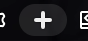
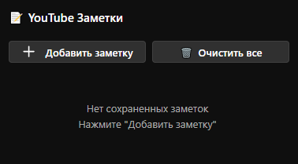
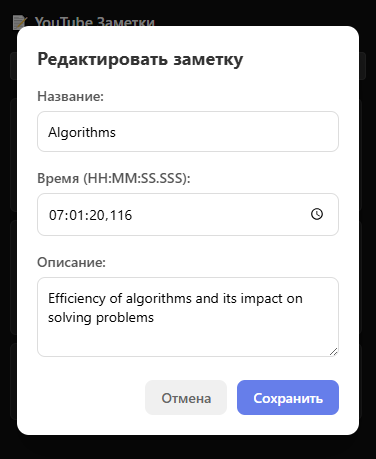

# Chrome Extension - Youtube Helper
Планируется доработка. Пока реализованы только заметки к видео

### Resources:
Расширения Chrome:
- Загрузка папки расширения (в режиме разработчика): введите во вкладке браузера - `chrome://extensions/`
- Начать (как загрузить расширение) https://developer.chrome.com/docs/extensions/get-started/tutorial/hello-world
- Документация https://developer.chrome.com/docs/extensions
- Справочник по API https://developer.chrome.com/docs/extensions/reference/api

### Info:
Расширение позволяет создавать заметки к видео Youtube. Данные хранятся в sync Chrome storage.

  
*Кнопка добавления заметки - под видео*

  
*Без заметок*

  
*С заметками*

  
*Редактирование заметки*